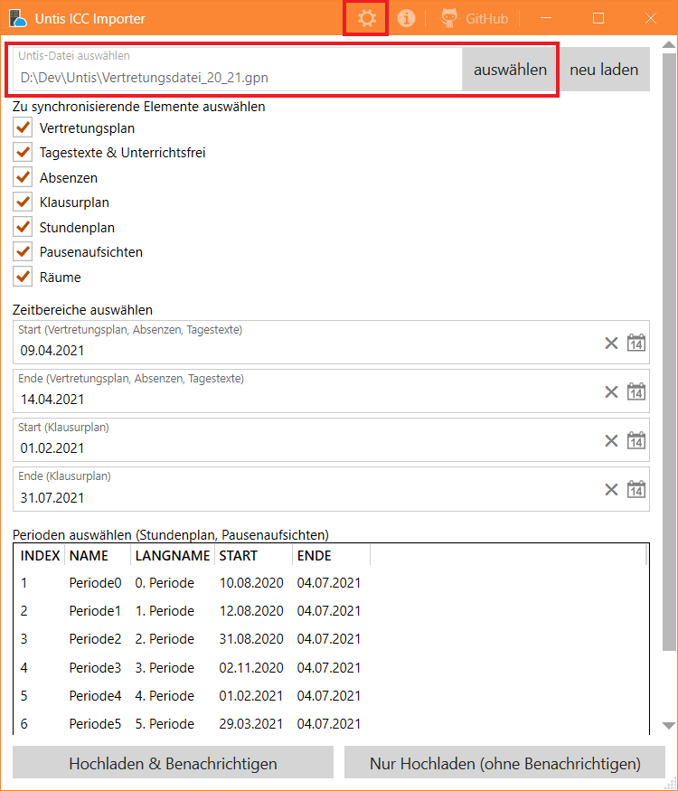
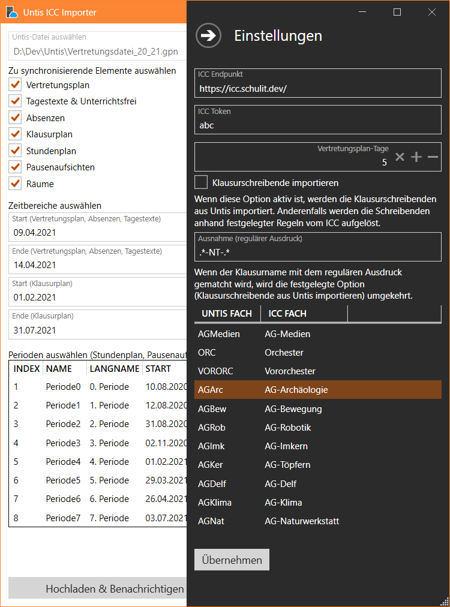

# Untis ICC Importer

Dieses Tool importiert Vertretungs-, Stunden- und Klausurplan (inkl. Pausenaufsichten, Absenzen und Tagestexten) sowie die Raumübersicht in das ICC. Dazu nutzt es die [UntisExport-Bibliothek](https://github.com/schulit/untisexport).

## Voraussetzungen

### Installationsvoraussetzungen

Das Importtool ist für Windows 10 und Windows Server (ab 2016) verfügbar. Es enthält alle Abhängigkeiten, insbesondere die .NET Core Runtime. 

Das Tool unterstützt die jeweils aktuelle Untis-Version des laufenden Schuljahres. Vergangene Untis-Versionen werden offiziell nicht unterstützt.

⚠ Es kann nur aus Untis-Dateien importiert werden. Eine MultiUser-Installation mit Datenbank wird nicht unterstützt.

Untis muss nicht auf dem Rechner installiert sein, auf dem auch Untis installiert ist. Es muss nur (lesender) Zugriff auf die Untis-Datei sichergestellt werden.

### Voraussetzungen für einen erfolgreichen Import

Damit der Import reibungslos funktioniert, werden folgende Dinge vorausgesetzt:

* Aktuell werden nur Untis-Dateien mit mehreren Perioden unterstützt. Als Workaround lässt sich eine Unterperiode anlegen und in dieser arbeiten.
* Wenn SchILD als zweite Datenquelle für das ICC genutzt wird, muss folgendes beachtet werden:
    * Die Fächerkürzel sollten identisch sein. Es ist jedoch möglich, Fächerkürzel zu überschreiben.
    * Die Kürzel der Lehrkräfte muss identisch sein.
    * Unterrichte müssen übereinstimmen, d.h. Fach- und Kurslehrkräfte müssen mit den Daten aus SchILD übereinstimmen.
    * Möchte man Klausurschreibende in Untis pflegen, müssen Lernende sauber importiert und stets gepflegt werden.
* Räume müssen aus Untis importiert werden. Möchte man Räume nicht aus Untis importieren, so müssen die importierten IDs der Räume mit dem Kursnnamen in Untis übereinstimmen.

## Installation

Installationspakete gibt es [auf GitHub unter Releases](https://github.com/SchulIT/untis-icc-importer/releases). Es stehen zwei Varianten zur Auswahl:

* MSI-Datei: Installation inkl. Startmenü-Eintrag.
* EXE-Datei: Ausführbare Datei ohne Installation ("Klick und Los" sozusagen).

## Konfiguration

Die Konfiguration kann über die grafische Oberfläche vorgenommen werden.

Die Untis-Datei lässt sich über den Button "auswählen" auswählen.

### Einstellungen

Die Einstellungen öffnen sich durch Klicken auf das Zahnrad in der organenen Fensterleiste.

* ICC Endpunkt: Hier trägt man die URL zum ICC ein. Das ist in der Regel https://icc.meine-domain.de/
* ICC Token: Das API-Token, welches in der [ICC-Installation festgelegt](https://icc.readthedocs.io/de/latest/admin/configuration.html#import-psk) wurde.
* Vertretungsplan-Tage: Wenn hier eine Zahl größer 0 eingetragen wird, so wird beim Starten des Programmes automatisch der heutige plus die nächsten Tage als Zeitbereich zum Import ausgewählt.
* Klausurschreibende importieren: Legt fest, ob die Klausurschreibenden aus Untis importiert werden sollen. Falls diese Option nicht aktiv ist, werden die Klausurschreiber anhand der Kurslisten und der im ICC unter Einstellungen -> Import festgelegten Regeln als Klausurschreiber automatisch importiert.
* Ausnahme (regulärer Ausdruck): Kehrt die zuvor festgelegte Option um (es werden dann also Klausurschreiber doch aus Untis exportiert oder doch nicht importiert).
    * Im Beispiel werden bei Klausuren mit `-NT-` im Namen die Schreibenden aus Untis übernommen.
* Wenn die Fächerkürzel in Untis nicht mit denen auf dem ICC übereinstimmen, kann man diese hier überschreiben. Beim Import wird das Fächerkürzel dann entsprechend der Tabelle übersetzt.
    * Neuer Eintrag: in die leere Fläche unterhalb eines Eintrages (oder falls noch kein Eintrag vorhanden ist: unterhalb der Überschriften) klicken und die Felder "Untis Fach" bzw. "ICC Fach" ausfüllen.
    * Eintrag bearbeiten: Doppelklick auf den jeweiligen Eintrag.
    * Eintrag löschen: Eintrag auswählen und Entf-Taste drücken

⚠ **Wichtig:** Damit die Einstellungen aktiv werden, müssen sie durch Klicken auf "Übernehmen" gespeichert werden.

## Import

1. Die gewünschten Elemente zum Import auswählen
2. Die Zeitbereiche angeben (falls notwendig)
3. Die gewünschten Perioden auswählen (falls notwendig)
4. Entweder "Hochladen & Benachrichtigen" oder "Nur Hochladen (ohne Benachrichtigen)" anklicken

**Wichtig:** 

* Tagestexte und Absenzen können nur in Kombination mit dem Vertretungsplan importiert werden.
* Pausenaufsichten können nur im Kombination mit dem Stundenplan importiert werden.

## Lizenz

MIT